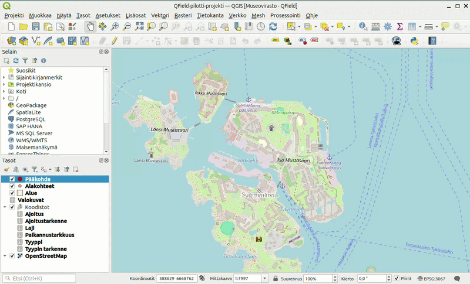
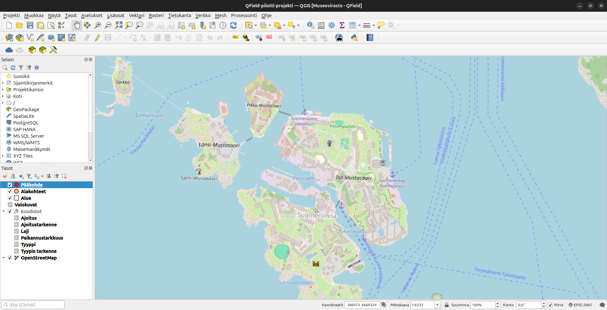
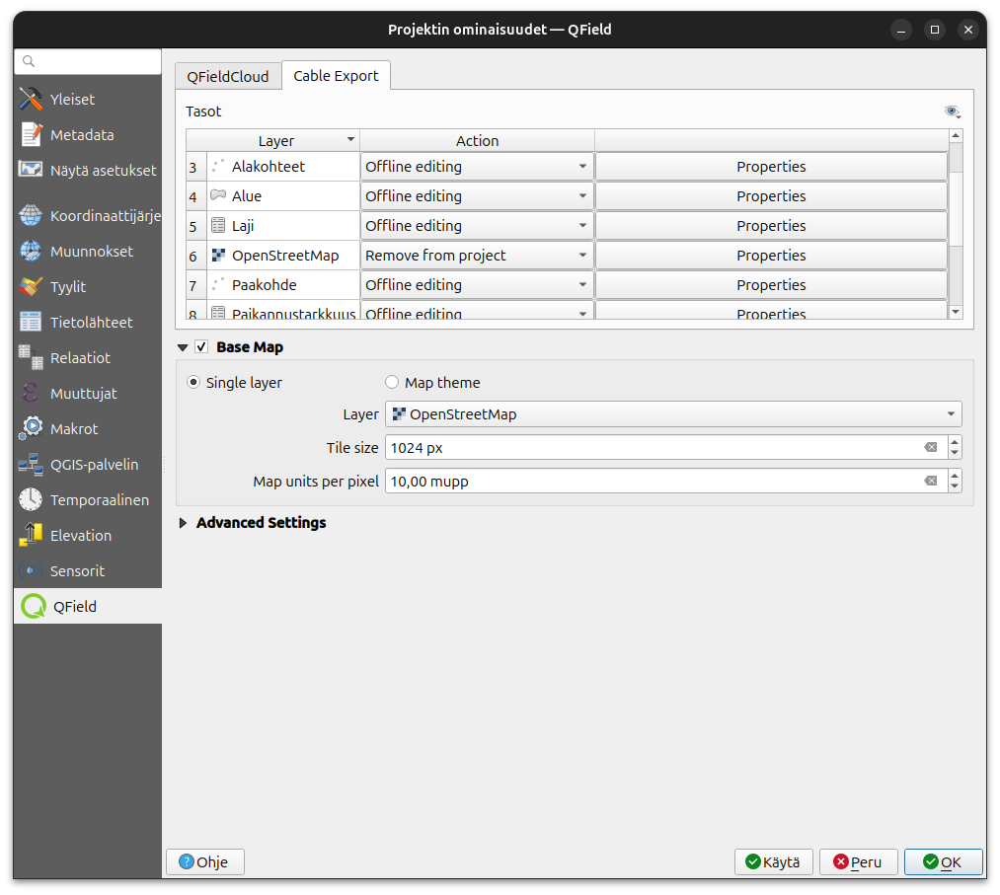

# Alkuvalmistelut

- Asenna itsellesi tietokoneelle [QGISin viimeisin vakaa versio (LTR)](https://qgis.org/fi/site/forusers/download.html).
- Asenna puhelimeesi [QField-sovelluksen sovelluskaupastasi](https://qfield.org/).

Lataa GeoPackage-tiedosto: 
- [QField-pilotti_2024 (Tyhjä)](https://mverkkodatashare.blob.core.windows.net/share/QField-pilotti_2024.zip).
- [QField-pilotti_2024 (Muinaisjäännösrekisterin aineistoilla):](https://mverkkodatashare.blob.core.windows.net/share/QField-pilotti_2024_mjreki.zip)

## Projektin avaaminen
GeoPackage-tiedosto sisältää QGIS-projektin, sekä kaikki tarvittavat tasot ja taulukot. Avaa QGIS tietokoneellasi ja raahaa lataamasi GeoPackage-tiedosto QGIS-ohjelmaan. Kun päästät irti tiedostosta niin uusi ikkuna aukeaa. Valitse tästä ainoastaan *QField-pilotti-projekti* (kuten kuvassa). Silloin QGIS avaa projektin sinulle suoraan, tasot ovat valmiiksi kytketty projektiin, joten tämän takia niitä ei lisätä erikseen.

## Lisäosan asentaminen
Jos et ole aiemmin asentanut QGISin lisäosan "QField Sync" niin tee se nyt. Jos et ole varma miten lisäosia lisätään voit katsoa seuraavan videon.

Tässä kuvassa näet miltä projekti näyttää oletusasetuksilla. 

**Tasot**-näkymässä näet, seuraavia tasoja

| Taso | Muoto | Selite |
|----------|----------|----------|
| Pääkohde| Piste| Jokaisella inventointikohteella on ainoastaan yksi pääkohde|
| Alakohteet | Piste| Pääkohteilla voi olla useampia alakohteita. Alakohde liittyy aina yhteen pääkohteeseen|
| Alue | Polygoni| Pääkohteilla pitäisi aina olla jokin aluemainen geometria myös, mikä piirretään tälle tasolle|
| Valokuvat| Taulukko| Pääkohteilla ja alakohteilla voi olla liittenä valokuvia, tiedostopolku valokuviin tallennetaan tähän taulukkoon|

Ryhmässä "Koodistot" on myös taulukkotasoja, mutta nämä ovat stattisia tauluja, mistä haetaan tietoja yllä oleviin tasoihin, joten näihin ei kannata koskea. Sieltä voi kuitenkin katsoa, mitä koodeja on käytössä.

## Taustakartan lisääminen
Jos haluat jotain tiettyjä taustakarttoja tai muita tasoja mukaan projektiin niin lisää ne tässä vaiheessa. Taustakartta on oletuksena OpenStreetMap, mutta tämä tulee varmaan useimmiten muokata jokskin muuksi. Lisää taso jonka haluat taustakartaksi ja avaa projektin ominaisuudet (Projekti-> Ominaisuudet -> QField). Valitse "Cable export"-välilehti. 

Näet "Base map"-osion missä voi valita taustakarttatasoa. Alla olevassa kuvassa tämä on OpenStreetMap niin voit vaihtaa sen. Voit esimerkiksi tarvita ilmakuvan, silloin vaihdat siihen ilmakuvatason. Käytännössä taustakarttasi tallenntuu nyt pakkauksen jälkeen geopackage-tiedostoon joka kulkee projektin mukana. 

Tarkista myös "Base map"-osion yläpuolella, "Tasot"-kohtaa. Jos käytössäsi on rajapinnan kautta tulevaa taustakarttaa niin suosittelemme laittamaan taustakarttatasosi "Action" tilaan "Remove from project". Silloin tasoa ei haeta rajapinnan kautta QFieldissa, mutta koska Base Map on kytketty päälle, niin taustakarttaa kuitenkin näkyy.

Jos tarvitset useampia tasoja niin hyvä käytäntö olisi rajata alue tarkkaan ja ladata niin rasteriaineistot paikallisesti (eli ei rajapinnan kautta). "Action"-tila pitää näille tasoille olla "Offline editing"-tilassa, kuten kaikki muutkin tasot.

QGIS-projekti viedään seuraavaksi QField-projektiksi omaan puhelimeen. Voidaan ajatella, että QGIS-projektista tehdään kopio jonka QField-sovellus voi käyttää. QField-sovelluksessa kerätään tietoja ja tämän jälkeen viedään tietoja takaisin tietokoneelle QGISiin, missä voi muokata tietoja ja lopuksi voi viedä ulos tietoja QGISistä esimerkiksi taulukkomuotoon.